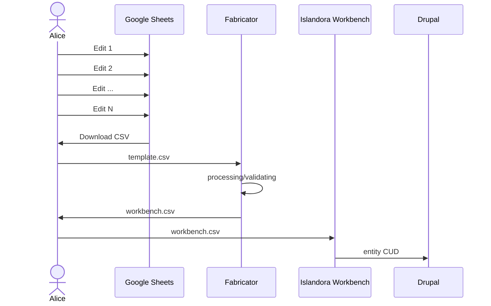

# fabricator

Prepare a CSV to load via Islandora Workbench

This is a convenience utility to allow a more user friendly spreadsheet to then be converted to the format Workbench expects. Can be thought of as middleware between normal spreadsheet curation and the format workbench expects.

## Overview



## Getting started

```
go run main.go \
  --source /path/to/google/sheet.csv \
  --target workbench.csv
```


## TODO
- [ ] HTTP service to allow a Google Sheets Apps script to validate a spreadsheet
- [ ] Validator service
- [ ] CSV transform service
