# fabricator

Transform a Google Sheet URL into a fully executed [Islandora Workbench](https://github.com/mjordan/islandora_workbench) task.

## Overview

- Content creators can work in Google Sheets to prepare a spreadsheet
- [A Google Appscript](./google/appsscript) is embeded in the sheet to allow easily checking their work
- When the spreadsheet is ready, it can be ingested into Islandora/Drupal via Islandora Workbench by supplying the sheet URL in [the GitHub Action](./.github/workflows/run.yml)

```mermaid
sequenceDiagram
    actor Alice
    Alice->>Google Sheets: Edit 1
    Alice->>Google Sheets: Edit 2
    Alice->>Google Sheets: Edit ...
    Alice->>Google Sheets: Edit N
    Alice->>Google Sheets: Click check my work
    Google Sheets->>Fabricator: Check this CSV
    Fabricator->>Alice: Looks good 🚀
    Alice->>GitHub: Run workbench workflow
    GitHub->>Self-hosted Runner: Run workbench workflow
    Self-hosted Runner->>Islandora Workbench: python3 workbench
    Islandora Workbench->>Drupal: entity CUD
    Islandora Workbench->>GitHub: logs
    Alice->>GitHub: View action logs
```



## Getting started

### Start the server

```
export SHARED_SECRET=changeme
go build
nohup ./fabrictor &
echo $! > pid
```

### Get a workbench CSV from a google sheet CSV

```
curl -s \
  -H "X-Secret: $SHARED_SECRET" \
  -XPOST \
  -o target.zip \
  --upload-file source.csv \
  http://localhost:8080/workbench/transform
```

### Stop the service

```
kill $(cat pid)
```
