# fabricator

Transform a Google Sheet URL into a fully executed [Islandora Workbench](https://mjordan.github.io/islandora_workbench_docs/) task.

## Overview

Content creators can work in Google Sheets to prepare a spreadsheet for bulk ingest. The Google Sheet can be structured in a manor that makes populating the content much more user friendly than the format a workbench CSV may require. e.g. some of Lehigh's fields need populated by workbench using JSON. Instead of asking a person to hand craft JSON, we can just create multiple columns that each contain a value that populates a given JSON field, and we can automate aggregating those columns and representing them in the correct JSON format

[A Google Appscript](./google/appsscript) is embeded in the sheet to allow easily checking the data in the spreadsheet is valid

When the spreadsheet is ready to have the content added to the repository, the metadata in the spreadsheet can be ingested into Islandora/Drupal via Islandora Workbench by [supplying the sheet URL in the GitHub Action](../.././actions/workflows/run.yml). Write access on this repo is required to execute the workflow

The GitHub Action is executed on a self-hosted runner within Lehigh's infrastructure. This allows uploading files directly from the same file server Lehigh staff use. This also allows ensuring the files referenced in the Google Sheet exist before executing the workbench job.

```mermaid
sequenceDiagram
    actor Alice
    participant Google Sheets
    participant Fabricator
    participant GitHub
    participant Slack
    Alice->>Google Sheets: Edit 1
    Alice->>Google Sheets: Edit 2
    Alice->>Google Sheets: Edit ...
    Alice->>Google Sheets: Edit N
    Alice->>Google Sheets: Click check my work
    Google Sheets->>Fabricator: Check this CSV
    Fabricator->>Alice: Looks good 🚀
    Alice->>GitHub: Run workbench workflow
    GitHub->>Self-hosted Runner: Run workbench workflow
    Self-hosted Runner->>Slack: Workbench job started
    Slack->>Alice: Message notification
    Self-hosted Runner->>Islandora Workbench: python3 workbench
    Islandora Workbench->>Drupal: entity CUD
    Islandora Workbench->>GitHub: logs streamed to GitHub Action UI
    Alice->>GitHub: Clicks Slack link to view GitHub Action logs while job runs
    Self-hosted Runner->>Slack: ✅ Workbench job succeeded!
```



## Technical details

This is an http service with two routes:

- `/workbench/check`
  - check if a google sheet content is well formed
- `/workbench/transform`
  - transform a google sheet CSV export into a workbench CSV

### Start the server

```
git clone https://github.com/lehigh-university-libraries/fabricator
docker build -t fabricator:main
docker run --rm -d -p 8080:8080 fabricator:main
```

### Ensure a google sheet CSV has no bad data

The `/workbench/check` route returns a JSON map keyed by the Google Sheet column/row of a cell and the error that cell contains. If the map is empty, there are no errors.

The route requires the CSV to be uploaded as JSON. This was done since the Google Sheets Appscript does not have a convenient SDK to convert a Google Sheet into a CSV. Instead, [the sheet is parsed cell by cell and stored as a JSON map](https://github.com/lehigh-university-libraries/fabricator/blob/86e77d8124dcbb522ca951ed3a1319e0193db73e/google/appsscript/check.gs#L18-L24). You can [see in the tests how the JSON is structured](https://github.com/lehigh-university-libraries/fabricator/blob/86e77d8124dcbb522ca951ed3a1319e0193db73e/internal/handlers/check_test.go#L81-L84).

There's also [an example script](./scripts/download.sh) on how to download a Google Sheet into the JSON format and also CSV format.

#### Example: no errors

```
$ curl -s \
  -H "X-Secret: $SHARED_SECRET" \
  -XPOST \
  --upload-file csv.json \
  http://localhost:8080/workbench/check
```
```
{}
```

#### Example: Row 12, Column A has a required field that is blank

```
$ curl -s \
  -H "X-Secret: $SHARED_SECRET" \
  -XPOST \
  --upload-file csv.json \
  http://localhost:8080/workbench/check
```
```
{"A12": "Missing value"}
```

### Get a workbench CSV from a google sheet CSV

The `/workbench/transform` route transforms a Google Sheet CSV into a Workbench CSV. The route returns a ZIP of CSVs. There are three possible flavors of CSVs that can be returned:

- target.csv - used to run [a workbench create task](./workbench-configs/create.yml)
  - this is the most common pattern used at Lehigh. This creates metadata and media/files for new content being added to the repository
- target.agent.csv - used to run [a workbench create_terms task](./workbench-configs/create_terms.yml)
  - this is returned when linked agents have additional metadata beyond just their name (e.g. email/institution/ORCiD)
  - this allows creating those linked agents with the proper metadata and associating that term with the given record
- target.update.csv - used to run [a workbench updaye task](./workbench-configs/update.yml)
  - this is returned when the Google Sheet contains node IDs in the sheet, signifying the job should be updating metadata for existing nodes

```
$ curl -s \
  -H "X-Secret: $SHARED_SECRET" \
  -XPOST \
  -o target.zip \
  --upload-file source.csv \
  http://localhost:8080/workbench/transform
$ unzip target.zip
```

## Adding new columns to the ingest template

If the ingest template needs a new column added, these are the code changes that are needed

- Add the column to [the ingest template](https://docs.google.com/spreadsheets/d/1iB7GsnfvhQO_c6TzJb7qwCnItqju0PMC8mNWepYqsnU/edit#gid=0), making row one the human-friendly label
- Make the necessary changes to [go-islandora](https://github.com/lehigh-university-libraries/go-islandora)
  - Add the column label and machine name to [the sheets slice in go-islandora](https://github.com/lehigh-university-libraries/go-islandora/blob/965bd728379bf2a9aa0ddb1fb46ec05fda636d87/cmd/sheetsStructs.go#L61)
  - generate the openapi schema and structs `go build && ./go-islandora generate sheets-structs --output=workbench.yaml`
- Make the necessary changes in this repo
  - Update go.mod `go get -u github.com/lehigh-university-libraries/go-islandora@main`
  - Add any necessary [checks](./internal/handlers/check.go) and [tests](./internal/handlers/check_test.go)
- Deploy the new image to the staging server
```
isle-stage
cd /opt/islandora/d10_lehigh_agile
sudo docker compose --profile prod pull
sudo systemctl restart islandora
```

TODO: This should eventually be able to be automatted, and the ingest template is simply generated by this repo ([Issue #23](https://github.com/lehigh-university-libraries/fabricator/issues/23)).
